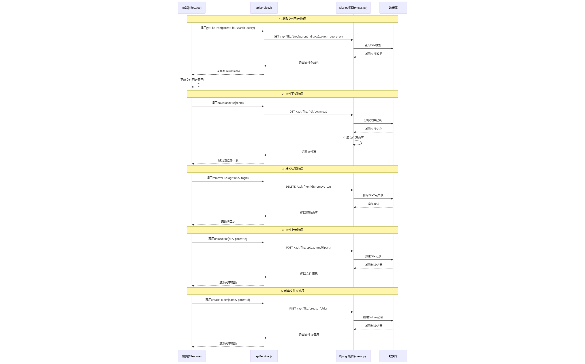
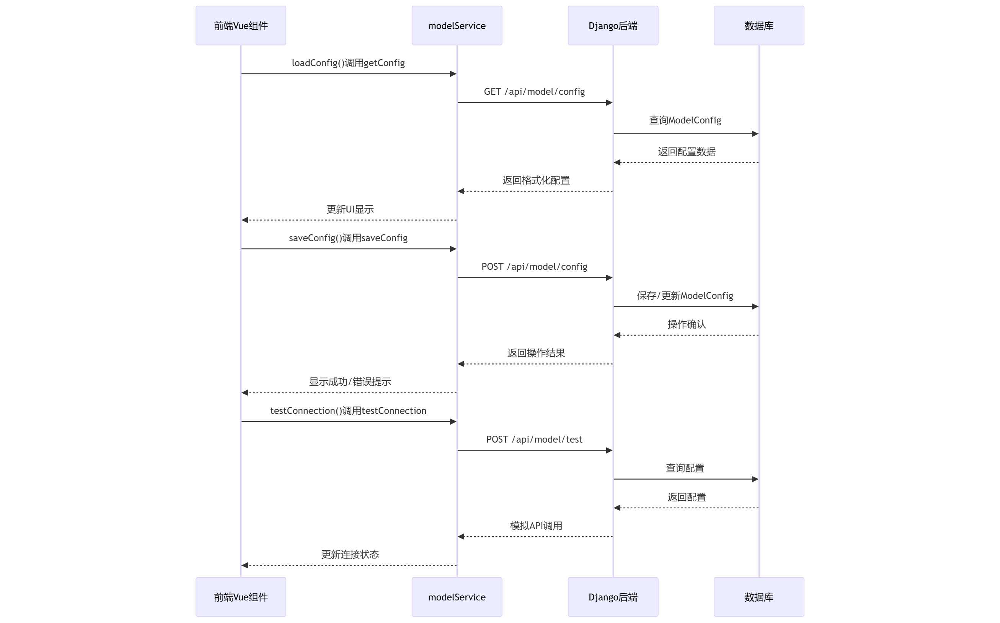

# aa

## 文件归档

在文件归档模块（页面中叫做归档中心）中，为了优化使用者的体验，我们在交互页面设计上借鉴了目前主流的一些网盘应用（如百度网盘等）和操作系统的文件系统，为使用者提供了网格和列表两种不同的视图模式。并且增加了右侧点击弹出菜单的操作，保证用户在交互上与在操作系统上使用文档没有任何区别。

文件归档模块中，使用者可以创建文件夹和上传文档，文件夹的使用与操作系统重文件夹的使用完全相同。当使用者创建文件夹或者上传文件后，文件归档模块会自动将文件信息保存到数据库中。并且前端页面为每个用户维护一个栈数据结构。当使用者位于根目录时，栈内元素为空，此时服务端会返回父节点为空的所有子节点数组（包括文件和文件夹）。每当使用者双击进入文件夹时会将文件夹的节点ID入栈，当使用者点击左侧导航栏中的“返回”按钮时，会将栈顶元素出栈，并且根据栈顶元素的ID作为父节点查询所有子节点。页面获取数据统一按照栈顶元素的ID进行查询（空栈时进行空值查询），这样就实现了文件夹的层级关系。

归档模块中保存的每一个文件都可以通过打标签的方式进行关联，这样做可以打打提高使用者指定归档策略时的灵活性，也更加方便使用者对文档进行分门别类。当文档被系统进行归档压缩后，文档上会有明确的表示图标，但是无论是否被压缩，当使用者调用下载接口是服务端会区分压缩算法，按照压缩前的算法选择对应的解压算法还原文件，这个解压步骤是在接口中进行的纯内存操作，因此无论文档是否压缩，对于使用者来说访问的都是源文档，这样无感解压缩的好处，也是避免解压过程中出现临时文件，从而占用系统磁盘空间。

## 策略配置模块

整个系统中策略配置包括两个模块，一个是智能模型的配置，一个是压缩归档策略的配置。

智能模型配置主要让使用之使用自己的模型APIKEY来接入大模型，目前支持的模型暂时只用DeepSeek。但是系统从设计之初，就已经预留了扩展空间，后续的开发计划将会提供更多厂家的大模型支持。在配置完成后，系统会将模型的APIKEY以及模型的地址存储在数据库中除了基础的调用必要参数外还通过查询模型厂家API调用手册，增加了一些特性化的参数，比如温度、上下文长度等。尤其是温度配置，需要让使用者可以根据自身的需求给出合适的温度，以下是DeepSeek官方推荐的温度参数配置指南，可以供使用者结合自身用途进行选择。另外，系统还提供使用者选择模型的能力，如deepseek-v3(chat模型)和deepseek-r1(推理模型)两种模型可供选择。可随时切换模型进行AI智能决策，但是从使用体验上还是建议使用者优先选择chat模型，因为推理模型有需要需要输出推理思维链，因此响应时间会较慢。

|场景	|温度|
|-----|----|
|代码生成/数学解题   |0.0|
|数据抽取/分析|1.0|
|通用对话|1.3|
|翻译|1.3|
|创意类写作/诗歌创作|1.5|

智能模型配置结束后，需要使用者配置自己的压缩策略和归档策略。压缩策略主要使用者不使用智能决策的前提下系统能够自动的根据文件的不同特征，合理的选择压缩方案，因此我们考虑到不同的维度提供了四种不同的压缩策略，文件类型、文件大小使用频率、业务场景。文件类型并不是由系统去判断文件的具体类型，这样做会导致每次文件上传后都需要读取文件特征（通常是文件魔数），这样会降低系统的性能，所以这里系统提供了一种基于文件后缀匹配的类型判断机制，使用者可以输入文件的后缀（支持正则语法），根据不同的后缀来选择压缩方案。文件大小则是根据文件大小的不同，选择不同的压缩方案，比如小于1KB的文件可以选择不压缩，大于1KB的文件则可以选择压缩。文件的使用频率在文件归档模块中被定义为文件的最近下载时间和下载次数，通过这些指标来判断文件是否被频繁访问，从而结合使用者指定的压缩方案进行压缩优化。初次之外，我们还考虑到文件被使用的业务场景，比如同样是word文件，但是有些文件应用于金融领域，有些是建筑领域，他们对于系统整体的磁盘要求是不同的，所以也应该选择不同的压缩方案。因此我们设计了标签管理模块，可以为文件打上一系列与使用者相关的业务标签，通过这些业务标签来映射出压缩方案。

使用者可以添加不同类型不同策略来组合成适合自己业务场景的决策链，归档策略则是让使用者能够灵活的调整归档周期，指定归档方案，归档策略中使用者可以选择是否智能决策，如果选用了智能决策，那么用户自定义的压缩策略将会实现，所有的算法决策将交由AI大模型进行智能决策。更适合初次使用系统的使用者。

所有策略制定好之后，使用者一旦保存，系统会首先将策略保存在数据库进行落盘，并且根据压缩策略生成执行链，系统底层会按照规则的优先级使用责任链设计模式来维护所有的压缩规则，并且生成执行计划；按照归档策略中设定的归档周期，来生成后台定时任务，并将任务交给APScheduler调度器进行调度。

## 标签管理模块

标签管理模块允许用户创建、编辑和删除标签，以及为每个标签分配一个唯一的标识符（ID）。此外，该模块还支持对标签进行分类，以便更好地组织和管理标签。系统内置提供了额外的颜色进行无状态分类，以及标签重要性来表明文件的重要程度。

所有的标签按照列表的形式展示，服务端使用了Django框架自带的分页工具能够快速的搭建和维护标签列表。标签模块作为系统的功能辅助模块旨在帮助使用者减少操作难度，提高了系统的使用灵活性。

## 用户界面设计

用户整体界面都是采用Tailwindcss和element-ui组件框架搭建，整体的样式统一，风格简约、清新。我们为系统专门设计了门户网站，当使用者未登录时只能够查看门户网站，门户网站的风格参考了各种互联网厂商，具备科技化的banner面板，并且加上了一些醒目的数字和合作厂商来展示系统的整体优势。

智能压缩模块中，所有的表单输入为标准件样式，方便使用者快速上手。同时，为了提高用户体验，我们专门对AI生成面板进行了优化。首先是流式响应式输出，参考了目前主流大模型的输出方式，能够有效的节省使用者的响应等待时间。并且要求大模型以markdown的形式返回输出结果。在markdown渲染面板的风格选择上，我们使用了github风格，整体配色方面选择白色作为主色，蓝色作为辅助色进行填充。

文档中心模块中，整体页面设计使用文件系统风格，左侧为文件目录视图，右侧为文件详情面板。设计了两种不同的文件展示方案，一种是网格视图，一种是列表视图。提供使用者不同的视觉效果。

模型配置中采用卡片面版的风格，并且添加了可供切换的TAB页面来切换模型选项，视口下半部分则使用一些图标组件来展示模型调用的一些数据，比如调用次数，调用延迟等

策略配置中采用双卡片风格来展示压缩策略和归档策略的指定。卡片背景设计采用渐变色，并且使用了一些元素来优化视觉效果比如悬空效果，遮盖阴影等，这让卡片整体看起来更加立体。使用者在操作的时候卡片还会有一些细微的动画效果来提升交互体验。

## 测试 

系统测试是软件开发过程中至关重要的环节，针对本系统将严格的指定测试方案，主要目标是为了验证系统功能是否符合需求规格，确保各模块协同工作的正确性。并且通过模块化的测试能够发现系统存在的潜在缺陷和性能瓶颈。本着对使用者负责人的态度，降低生产环境故障风险，预防数据丢失或损坏；我们针对平台的实际架构和业务场景设计，覆盖核心功能模块的关键测试点，采用黑盒与白盒相结合的测试方法，确保测试全面有效。

### 测试用例